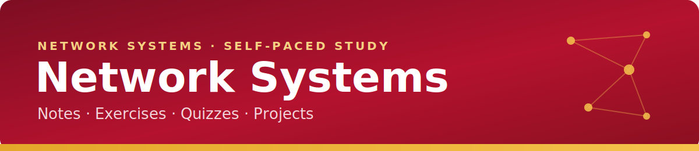

# 01-05: Troubleshooting Methodology & Safety

<!-- course-header -->

   

<!-- /course-header -->

## The 7-Step CompTIA Troubleshooting Model

1. **Identify the problem** — gather information, question users, note symptoms and recent changes.
2. **Establish a theory of probable cause** — question the obvious; consider multiple approaches (OSI top-down or bottom-up).
3. **Test the theory** — confirm or refute it. If refuted, form a new theory or escalate.
4. **Establish a plan of action** — decide the fix and identify potential side effects.
5. **Implement the solution** — apply the fix (or escalate).
6. **Verify full system functionality** — confirm the fix works and implement preventive measures.
7. **Document findings, actions, and outcomes** — record everything for future reference.

> **First step:** Identify the problem. **Last step:** Document.

---

## OSI-Based Troubleshooting

- **Bottom-up** — start at Physical (cable, link light) and move up. Good when a hardware fault is suspected.
- **Top-down** — start at Application and move down. Good when an app-specific issue is reported.
- **Divide and conquer** — start in the middle (e.g., ping tests at Layer 3).

---

## Safety Best Practices

| Concern | Practice |
|---------|----------|
| **ESD (static)** | Use an anti-static (ESD) strap; ground yourself before handling components |
| **Electrical** | Power down and unplug before servicing; respect PSU capacitors |
| **Hazardous materials** | Follow the **MSDS/SDS** for toner, batteries, cleaning agents |
| **Physical** | Use proper lifting technique for heavy racks/UPS units |
| **Fire** | Use plenum-rated cable in air spaces; know extinguisher types |

---

> [!TIP]
> **Key idea —** Troubleshooting is a **repeatable process**: identify → theorize → test → plan → implement → verify → document. Pair it with the **OSI model** to isolate the layer at fault, and always work safely (ESD strap, MSDS).

See also: [The OSI Model](01-03-osi-model.md), [CLI Troubleshooting Tools](03-07-cli-troubleshooting-tools.md)

<!-- course-footer -->
---

<strong>Previous:</strong> <a href="01-04-network-hardware.md">Network Hardware Devices</a> &nbsp;|&nbsp; <a href="README.md">All Notes</a> &nbsp;|&nbsp; <a href="../02-exercises/01-exercise.md">Module 01 Exercise</a> &nbsp;|&nbsp; <strong>Next:</strong> <a href="02-01-structured-cabling.md">Structured Cabling</a>

<!-- /course-footer -->
