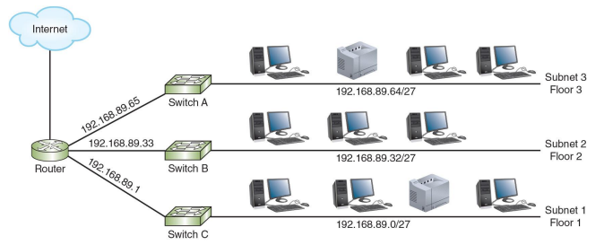
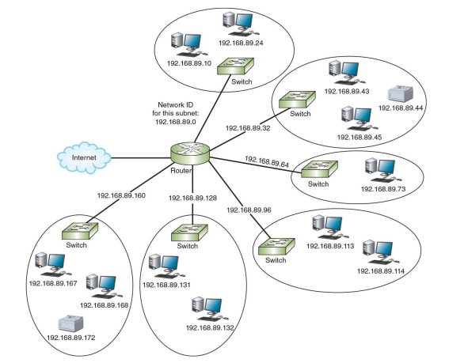
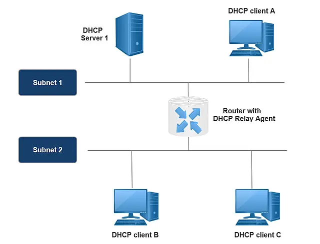

# 08-09: Implementing Subnets on a Network

<!-- course-header -->

<a href="../README.md">Home</a> &nbsp;|&nbsp; <a href="README.md">All Notes</a> &nbsp;|&nbsp; <a href="../02-exercises/08-exercise.md">Practice Set</a> &nbsp;|&nbsp; <a href="../03-quiz/">Quiz Hub</a>

| Course | Module | Lesson |
| --- | --- | --- |
| Network Systems | 08: Subnets and VLANs | 08-09 |
<!-- /course-header -->

## Why Implement Subnets?

Subnetting is not only a mathematical process, but also a practical network design technique.

It is used to:
- divide a large network into smaller subnetworks  
- reduce broadcast traffic  
- improve network performance  
- enhance security  

Each subnet forms a **separate broadcast domain**.

---

## Basic Network Structure

A subnetted network typically consists of:

### Router
- connects multiple subnets  
- each interface represents a different subnet  

### Switch
- connects devices within a subnet  

### Hosts (PCs, printers)
- assigned IP addresses within a subnet  

---

## Subnet Assignment Example

Example:

- Subnet 1: 192.168.89.0/27  
- Subnet 2: 192.168.89.32/27  
- Subnet 3: 192.168.89.64/27  

👉 Each subnet must have a **unique network ID**.

---

## Default Gateway

Each subnet requires a **default gateway** to communicate with other networks.

- The default gateway is usually the **router interface IP**

**Example:**
- Subnet 1 → Gateway: 192.168.89.1  
- Subnet 2 → Gateway: 192.168.89.33  
- Subnet 3 → Gateway: 192.168.89.65  

---

## Communication Between Subnets

- Devices within the same subnet communicate **directly**  
- Devices in different subnets communicate through a **router**  

---

## One Router Connecting Multiple LANs

A single router can connect multiple LANs:
- Each LAN is assigned a different subnet  
- Each subnet is isolated from others  
- The router enables communication between subnets  

**Common use cases:**
- office networks  
- campus networks  
- multi-floor buildings  

---

## DHCP Across Subnets

### Problem

DHCP uses **broadcast messages**, which do not cross routers.

---

### Solution: DHCP Relay Agent

A **DHCP relay agent** allows DHCP communication across subnets.

---

## How DHCP Relay Works

1. A client sends a DHCP request (broadcast)  
2. The router receives the request  
3. The router forwards it to the DHCP server (unicast)  
4. The DHCP server assigns an IP address  

---

## Summary

- Subnet → logical division of a network  
- Router → connects subnets  
- Switch → connects devices within a subnet  
- Default gateway → exit point of a subnet  
- DHCP relay → enables DHCP across subnets  

---

## Key Insight

Subnetting transforms a large network into smaller, manageable networks, enabling efficient communication and better network design in real-world environments.

<!-- course-footer -->
---

<strong>Previous:</strong> <a href="08-08-subnet-calculation-using-binary.md">Subnet Calculation Using Binary</a> &nbsp;|&nbsp; <a href="README.md">All Notes</a> &nbsp;|&nbsp; <a href="../02-exercises/08-exercise.md">Module 08 Exercise</a> &nbsp;|&nbsp; <strong>Next:</strong> <a href="08-10-vlsm.md">Variable Length Subnet Mask (VLSM)</a>

<!-- /course-footer -->
