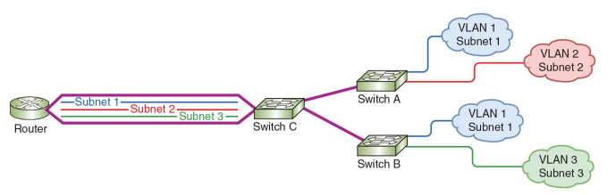

# 08-12: Virtual LAN (VLAN)

<!-- course-header -->

   

<!-- /course-header -->

## What is a VLAN?

A VLAN (Virtual Local Area Network) is a logical grouping of devices within a network, regardless of their physical location.

It allows a single physical network to be divided into multiple **separate broadcast domains**.

👉 Devices in the same VLAN can be located on different switches, yet still belong to the same logical network.

👉 Devices connected to the same switch can belong to different VLANs.

---

## Why VLANs are Used

- Improve network performance (reduce broadcast traffic)  
- Enhance security by isolating groups  
- Simplify network management  
- Allow logical grouping instead of physical grouping  

---

## Basic Concept

Without VLAN:
- All devices are in the same broadcast domain  

With VLAN:
- Devices are separated into different logical networks  

👉 Even if connected to the same switch  

---

## Example

- VLAN 10 → HR Department  
- VLAN 20 → Finance Department  
- VLAN 30 → IT Department  

Devices in different VLANs:
- cannot communicate directly  
- require a router (Layer 3 device)  

---

## VLAN Characteristics

- Each VLAN is a **separate broadcast domain**  
- Devices in the same VLAN behave as if they are on the same network  
- VLANs are configured on switches  

---

## VLAN ID

Each VLAN is identified by a **VLAN ID**.

- Range: 1 – 4094  
- Example:
  - VLAN 10  
  - VLAN 20  

---

## Types of VLAN

Common VLAN types include:

- **Default VLAN**
  - Typically preconfigured on a switch (usually VLAN 1)  
  - Initially includes all switch ports  

- **Native VLAN**
  - Carries **untagged traffic** on trunk ports  

- **Data VLAN**
  - Carries user-generated traffic  
  - Example: web, email, applications  

- **Management VLAN**
  - Used for administrative access  
  - Example: SSH, SNMP  

- **Voice VLAN**
  - Supports VoIP traffic  

- **Private VLAN (PVLAN)**
  - Divides a VLAN into smaller subdomains  

  Types:
  - **Isolated VLAN** → no communication between devices  
  - **Community VLAN** → limited group communication  

---

## Access Ports vs Trunk Ports

### Access Port
- Belongs to a single VLAN  
- Connects end devices  

### Trunk Port
- Carries traffic for multiple VLANs  
- Used between switches or switch–router  

---

## VLAN Tagging (802.1Q)

VLANs use **IEEE 802.1Q tagging**:

- Adds a VLAN ID to Ethernet frames  
- Used on trunk links  
- Native VLAN carries untagged frames  

---

## VLAN vs Subnet (Important Concept)

- VLAN → Layer 2 (Data Link Layer)  
- Subnet → Layer 3 (Network Layer)  

👉 In practice:

- One VLAN is typically mapped to one subnet  

Example:
- VLAN 10 → 192.168.1.0/24  
- VLAN 20 → 192.168.2.0/24  

### Key Points

- Devices in different VLANs:
  - are in different broadcast domains  
  - belong to different subnets  
  - require routing to communicate  

❌ Same subnet across multiple VLANs is not standard practice  

---

## VLANs and Subnets (One-to-One Mapping)

### Concept

- Each VLAN corresponds to a separate subnet  
- Multiple VLANs exist on switches  
- Each VLAN is a separate broadcast domain  

---

### Note

Devices in the same VLAN can exist on different switches.

👉 Even if physically separated, they remain in the same broadcast domain as long as the VLAN ID is the same.

---

### How It Works

A router connects multiple VLANs using a single physical interface.

This interface is divided into **logical subinterfaces**:

Example:

- G0/0.10 → VLAN 10 → Subnet 1  
- G0/0.20 → VLAN 20 → Subnet 2  
- G0/0.30 → VLAN 30 → Subnet 3  

👉 This is called **Router-on-a-Stick**

---

### Why This is Important

- Saves router interfaces  
- Enables inter-VLAN communication  
- Widely used in real networks  

---

## Inter-VLAN Communication

Devices in different VLANs cannot communicate directly.

👉 Requires:
- Router (Router-on-a-stick)  
or  
- Layer 3 switch  

---

## Advantages of VLAN

- Better security  
- Reduced broadcast traffic  
- Improved performance  
- Flexible network design  

---

## Key Idea

VLANs logically divide a physical network,

👉 creating multiple isolated broadcast domains.

👉 In real networks:
- VLAN (Layer 2) + Subnet (Layer 3) work together

<!-- course-footer -->
---

<strong>Previous:</strong> <a href="08-11-ipv6-subnetting.md">Subnets in IPv6</a> &nbsp;|&nbsp; <a href="README.md">All Notes</a> &nbsp;|&nbsp; <a href="../02-exercises/08-exercise.md">Module 08 Exercise</a> &nbsp;|&nbsp; <strong>Next:</strong> <a href="09-01-security-concepts.md">Security Concepts</a>

<!-- /course-footer -->
